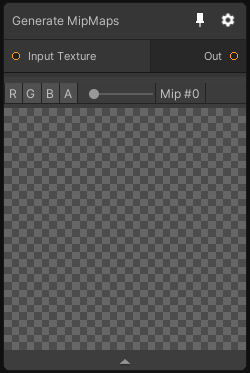

# Generate MipMaps

## Inputs
Port Name | Description
--- | ---
Input Texture | 

## Output
Port Name | Description
--- | ---
Out | 

## Description
Generate mipmaps for the input texture. You can choose between 4 modes to generate the mip chain:
- Auto, it uses the built-in unity mipmap generation code (see https://docs.unity3d.com/ScriptReference/Rendering.CommandBuffer.GenerateMips.html).
- Gaussian, generate the mips using a gaussian filter.
- Max, generate the mips using a Max operation, it can be useful when manipulating depth textures
- Custom, you can create a new shader that will be used to generate the mipmaps. Click on the "New Shader" button to create a new mipmap shader. If you add properties to your shader, they will be displayed as input of the node.

